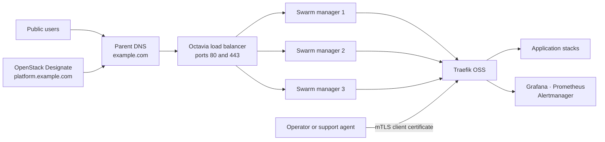
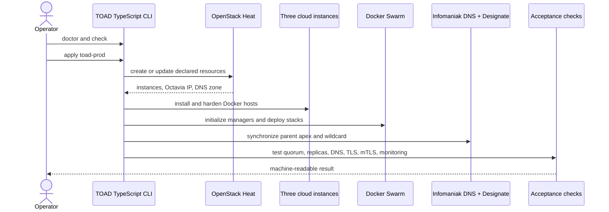
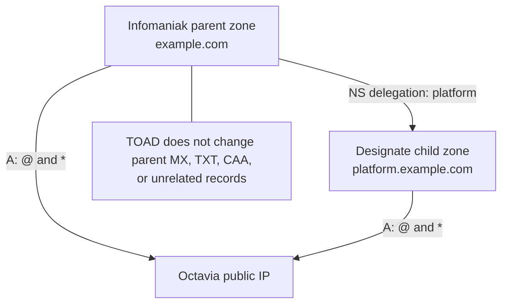
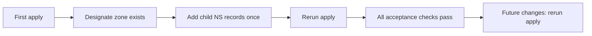
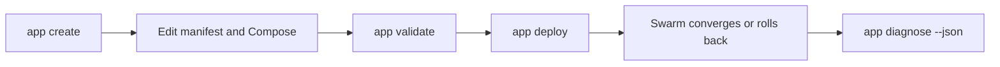
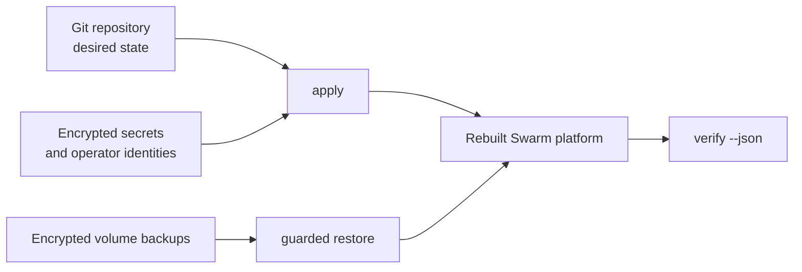

# TOAD infra

TOAD deploys a small, production-shaped Docker Swarm platform on Infomaniak
Public Cloud. It uses OpenStack Heat for cloud resources, Ansible for host
configuration, Traefik for automatic HTTPS routing, and a TypeScript CLI for
the complete lifecycle. Terraform is intentionally not used.

This guide follows the normal production path: three Swarm managers, an
Octavia load balancer, delegated DNS, automatic certificates, monitoring, and
mTLS-protected admin interfaces.

> All domain names in this documentation are placeholders. Replace
> `example.com` with a domain you control and `platform.example.com` with the
> delegated child domain you want TOAD to manage.

## What gets deployed



| Profile | Intended use | Nodes | Public entry points |
|---|---|---:|---:|
| `1` | Development or evaluation | 1 manager | 1 floating IP |
| `5` | Maintained production profile | 3 managers | SSH bootstrap IP + Octavia IP |

Three managers are the smallest Swarm control plane that can lose one manager
and retain quorum. Swarm is the maintained default because its operational
surface is small and its Traefik label integration is excellent.

## Before you start

You need:

- an Infomaniak Public Cloud project with enough quota for three instances,
  networks, floating IPs, and one Octavia load balancer;
- a dedicated project service user with a password;
- a domain hosted in Infomaniak DNS;
- an Infomaniak API token limited to `dns:read` and `dns:write`;
- Node.js 22, pnpm, Python 3 with `venv`, OpenSSH, and Docker;
- `age` and `age-keygen` when using encrypted secrets or backups.

Do not use a personal Infomaniak password. Heat creates a Keystone trust, so
the full deployment currently requires a dedicated password-authenticated
service user rather than an OpenStack application credential.

For the examples below:

| Setting | Example | Meaning |
|---|---|---|
| Stack name | `toad-prod` | Name of the Heat stack |
| Parent domain | `example.com` | Existing zone in Infomaniak DNS |
| Platform domain | `platform.example.com` | Child zone delegated to Designate |
| Application URL | `hello.platform.example.com` | Routed automatically by Traefik |

## Deployment flow



The first deployment has one manual DNS delegation step. Every later `apply`
is an idempotent create-or-update operation.

## 1. Get the project and validate your workstation

```sh
git clone https://github.com/RemiGirard/TOAD-infra.git
cd TOAD-infra/openstackV3
pnpm install --frozen-lockfile
pnpm run check
pnpm run doctor -- --json
```

The doctor reports missing prerequisites without printing credential contents.
Resolve failures before continuing. A missing host `age` binary is acceptable
only if all secret and backup operations will run through the operator image.

## 2. Create the cloud service user

In Infomaniak Manager, open **Public Cloud → Users**, create a user dedicated
to this deployment, and give it the project roles required for Compute,
Network, Orchestration, Load Balancing, and DNS.

Download its `clouds.yaml` and save it as:

```text
openstackV3/credentials/clouds.yaml
```

Do not commit the `credentials/` directory. If `clouds.yaml` does not contain
the password, `pnpm run setup` asks for it without echoing and stores it in the
ignored `credentials/password` file with mode `0600`.

Initialize the project-local OpenStack CLI and SSH key:

```sh
pnpm run setup
pnpm run doctor -- --cloud
pnpm run discover
```

`discover` prints the available flavors, immutable image UUIDs, networks,
availability zones, and quota. Use an image UUID, not a mutable image name.

## 3. Configure the deployment

From `openstackV3`:

```sh
cp heat/env/example.yaml heat/env/production.yaml
cp ../router/config.example.yaml ../router/config.yaml
```

Edit `heat/env/production.yaml`:

```yaml
parameters:
  flavor: "YOUR_FLAVOR"
  image: "YOUR_IMMUTABLE_IMAGE_UUID"
  keypair_name: "toad-key"
  public_network: "YOUR_PUBLIC_NETWORK"
  ssh_allowed_cidr: "192.0.2.1/32"
  dns_zone_name: "platform.example.com."
  dns_email: "hostmaster@example.com"
  manager1_availability_zone: "YOUR_AZ_1"
  manager2_availability_zone: "YOUR_AZ_2"
  manager3_availability_zone: "YOUR_AZ_3"
```

The `apply` command replaces the documentation SSH CIDR with the operator
workstation's current public IPv4 `/32`. It never intentionally opens SSH to
`0.0.0.0/0`.

Edit `router/config.yaml`:

```yaml
letsencrypt_email: admin@example.com
traefik_log_level: INFO
base_domain: platform.example.com
root_domain: example.com
```

TOAD owns the following DNS records once deployed:



The parent `@` and `*` records will point to TOAD. Use a dedicated domain if
that is not appropriate for an existing website. The child `NS` delegation is
manual and deliberately survives stack deletion.

## 4. Add the restricted DNS token

Create an Infomaniak API token with only `dns:read` and `dns:write`, then store
it through the non-echoing prompt:

```sh
pnpm run dns-token
```

The token stays in the ignored local credentials directory. Traefik receives
it as a versioned Docker secret, never as a Compose label or environment file.

## 5. Deploy

```sh
pnpm run check
pnpm run doctor -- --cloud
pnpm run apply -- toad-prod heat/env/production.yaml
```

`apply` performs the entire reconciliation:

1. validates the Heat template and local inputs;
2. creates or updates the network, security groups, instances, floating IPs,
   Octavia load balancer, and Designate zone;
3. generates the Ansible inventory;
4. installs Docker and creates the three-manager Swarm;
5. deploys Traefik, monitoring, the landing page, and test services;
6. initializes the local admin mTLS PKI;
7. synchronizes the parent-domain apex and wildcard records;
8. verifies infrastructure, Swarm, DNS, HTTPS, mTLS, and monitoring.

On the first run, public verification may wait or fail until the child zone is
delegated. This does not require rebuilding anything.

## 6. Delegate the platform child zone once

List the child zone's `NS` record:

```sh
pnpm run os -- recordset list platform.example.com.
```

In the Infomaniak DNS zone for `example.com`, create `NS` records named
`platform` using the authoritative nameservers shown by Designate. Then wait
for DNS propagation and rerun the same apply command:

```sh
pnpm run apply -- toad-prod heat/env/production.yaml
```



## 7. Verify the installation

```sh
pnpm run verify -- toad-prod --json
```

The production verifier checks manager quorum, service replica counts, load
balancer members, DNS, redirects, public certificates, test endpoints,
monitoring targets and rules, and rejection of unauthenticated admin requests.

You should then have:

| URL | Access |
|---|---|
| `https://example.com/` | Public landing page |
| `https://hello.platform.example.com/` | Public deployment test |
| `https://whoami.platform.example.com/` | Public routing test |
| `https://traefik.platform.example.com/dashboard/` | Admin mTLS |
| `https://grafana.platform.example.com/` | Admin mTLS |
| `https://prometheus.platform.example.com/` | Admin mTLS |
| `https://alerts.platform.example.com/` | Admin mTLS |

### If deployment stops

Do not start by changing resources manually in Horizon. Use the layer-specific
diagnostic so the repository remains the source of truth:

| Symptom | First command |
|---|---|
| Local prerequisite or credential failure | `pnpm run doctor -- --cloud` |
| Heat stack failure | `pnpm run os -- stack failures list toad-prod --long` |
| Child domain does not resolve | `pnpm run os -- recordset list platform.example.com.` |
| Swarm manager or quorum problem | `pnpm run maintenance -- status --json` |
| One application is unhealthy | `pnpm run app -- diagnose APP --json` |
| Public TLS or monitoring failure | `pnpm run verify -- toad-prod --json` |

After correcting configuration, rerun `apply`; do not repair ordinary desired
state with ad-hoc `docker service update` or manual cloud-console changes.

## 8. Import the admin certificate

The first apply creates an initial browser bundle under:

```text
openstackV3/credentials/admin-pki/operator.p12
```

Import it into the operator's browser or operating-system certificate store
using the password stored beside it. These files are private operator state;
back up the CA key securely and never copy it to a server.

Issue a separate short-lived identity for each person or device:

```sh
pnpm run admin-pki -- issue alice-laptop 90
```

There is no shared dashboard password or JWT service to maintain. The browser
presents the client certificate during the TLS handshake.

## Deploy an application



Create a safe starter application:

```sh
pnpm run app -- create my-service
# Edit ../apps/my-service/toad.yaml and docker-compose.yaml
pnpm run app -- validate my-service
pnpm run app -- deploy my-service
pnpm run app -- diagnose my-service --json
```

The generated route is `https://my-service.platform.example.com`. Application
images must use immutable SHA-256 digests. Direct published ports, privileged
containers, missing resource limits, and unsafe volume contracts are rejected.
Traefik routes applications through the shared `traefik-public` overlay.

Useful lifecycle commands:

```sh
pnpm run app -- list
pnpm run app -- status my-service
pnpm run app -- logs my-service
pnpm run app -- verify my-service
pnpm run app -- rollback my-service
pnpm run app -- remove my-service
```

See the [agent runbook](docs/AGENT-RUNBOOK.md) for safe agent-assisted
diagnosis and deployment.

## Routine operation

```sh
pnpm run doctor -- --cloud
pnpm run maintenance -- status --json
pnpm run verify -- toad-prod --json
```

If the operator's public IP changes, update only the Heat-managed SSH rule:

```sh
pnpm run maintenance -- refresh-ssh-access toad-prod --yes
```

For client isolation, create one context per customer or environment:

```sh
pnpm run context -- create customer-prod --use
pnpm run context -- current --json
```

Each context has separate configuration, credentials, inventory, backups, and
an operation lock. Never reuse one context across unrelated clients.

## Backup and recovery

Back up platform volumes before manager replacement or destructive work:

```sh
pnpm run platform -- list
pnpm run platform -- backup
pnpm run platform -- verify --from /secure/platform-backup/index.json --json
```

The archives are streamed off the manager and encrypted with age. Copy them
and the age identity to separate protected storage. Restores replace one exact
volume and require explicit confirmation.



Read [operations and recovery](docs/OPERATIONS.md),
[stateful storage profiles](docs/STATEFUL-STORAGE.md), and the
[disaster-recovery drill](docs/DISASTER-RECOVERY.md) before restoring or
destroying data.

## Destroying a stack

Destruction is intentionally separate from `apply` and requires confirmation:

```sh
pnpm run destroy -- toad-prod
```

This removes only resources owned by the named Heat stack. The parent-zone NS
delegation, local credentials, admin CA, age identity, and external backups
remain. Review the exact stack resources before deletion.

## Repository map

| Path | Purpose |
|---|---|
| `openstackV3/` | TypeScript operator CLI and Heat templates |
| `ansible/` | Host, Swarm, ingress, and monitoring configuration |
| `router/` | Traefik Swarm stack |
| `apps/` | Manifest-driven example and user applications |
| `monitoring/` | Prometheus, Grafana, Loki, Alloy, and alerts |
| `docs/` | Operations, recovery, storage, releases, and agent procedures |

## Current boundaries

- The production provider is Docker Swarm. Kubernetes should be implemented as
  a separate provider rather than hidden conditionals in the Swarm path.
- Traefik OSS runs one replica because its local ACME store cannot safely have
  multiple writers. Swarm reschedules it, and encrypted platform backups
  protect its state.
- Local named volumes are not replicated. Stateful workloads must select an
  explicit storage and backup profile.
- Monitoring inside the Swarm cannot detect a complete provider outage; run
  the credential-free external probe from another provider or GitHub Actions.

## License

TOAD is free software under the
[GNU Affero General Public License, version 3 or later](LICENSE)
(`AGPL-3.0-or-later`). You may use, study, modify, and redistribute it under
those terms. Modified versions offered as network services must provide their
corresponding source as required by AGPL section 13.
