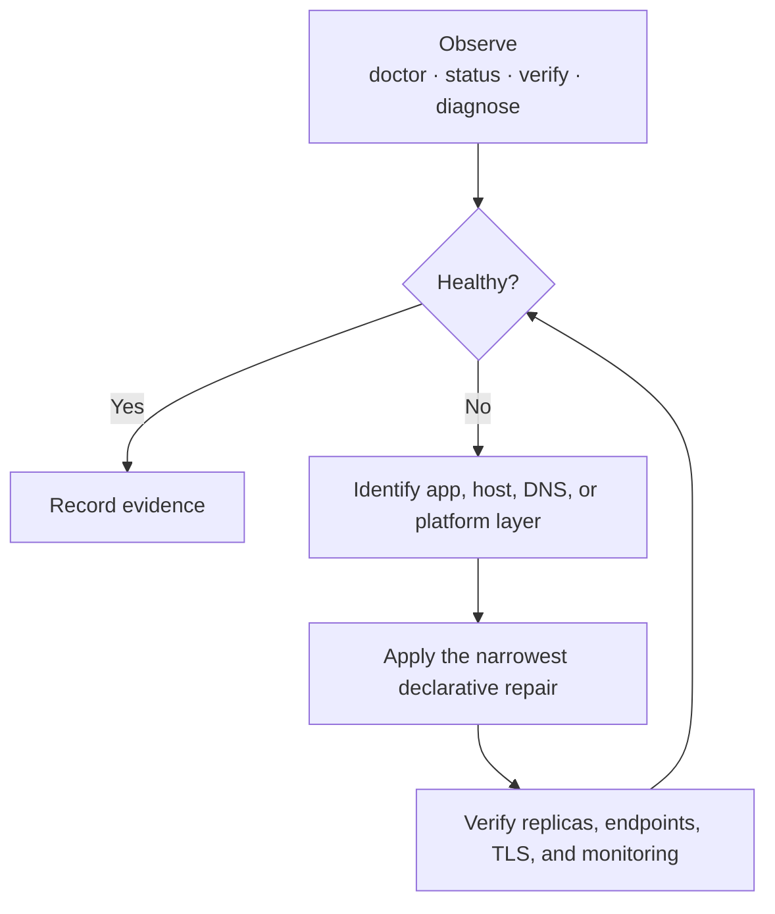
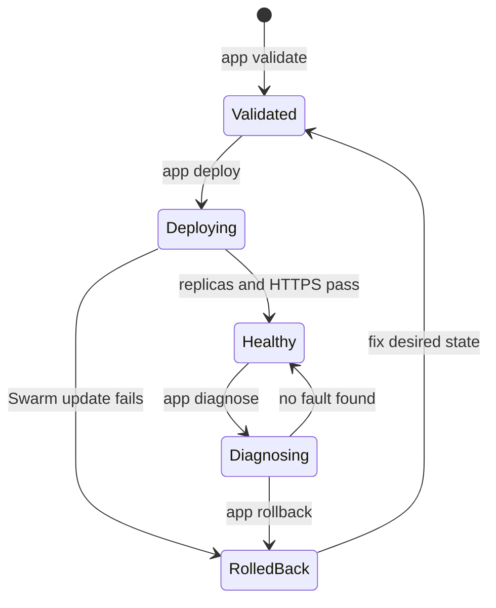
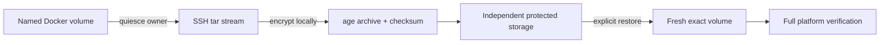

# Operations and recovery

Examples use the stack `toad-prod`, parent domain `example.com`, and delegated
platform domain `platform.example.com`. Replace them with the values in the
selected client context.



## Automatic public certificates and parent DNS

`example.com` and every direct subdomain use one ACME wildcard certificate
requested through Infomaniak DNS-01. Traefik reads the API token from
`/run/secrets/infomaniak-dns-token`; it is never placed in a stack label or a
remote file. The external Docker secret name includes a hash of the token, so
rotation is an ordinary `apply` and does not mutate a Swarm secret in place.

The delegated `platform.example.com` routes retain Traefik HTTP-01 certificates,
because their authoritative records belong to OpenStack Designate rather than
the parent Infomaniak zone. Both resolvers store renewal state in the pinned
Traefik certificate volume.

The TypeScript DNS reconciler reads the current `lb_floating_ip` Heat output and
sets only the Infomaniak parent-zone `@` and `*` A RRsets. It runs after ingress
and the landing service are deployed, minimizing rebuild cutover time. It
leaves mail, verification records, and the `toad` NS delegation untouched.

Token rotation:

1. Create a new token with `dns:read` and `dns:write`.
2. Replace `openstackV3/credentials/infomaniak-dns-token` and keep mode `0600`.
3. Run `pnpm run apply -- toad-prod heat/env/production.yaml`.
4. After verification, revoke the old token in Infomaniak Manager.

For a DNS-only repair, run `pnpm run dns -- toad-prod`. `pnpm run verify --
toad-prod --json` checks apex DNS, a fresh random wildcard name, HTTP redirects,
and publicly trusted TLS.

## Credential model

Create a dedicated Infomaniak Public Cloud service user for one project; never
use the owner account. Assign the project roles needed by Nova, Neutron, Heat,
Octavia, and Designate. Heat creates a Keystone trust during stack operations,
and Infomaniak rejects trust management from delegated/application-credential
tokens, so this end-to-end profile currently requires password authentication.

Store `clouds.yaml` only at `openstackV3/credentials/clouds.yaml`. Prefer to
omit `auth.password` and let `pnpm run setup` save the password separately at
`openstackV3/credentials/password`. Both paths are Git-ignored and must be mode
`0600`.

The CLI still supports application credentials for OpenStack operations that do
not invoke Heat. Do not commit credentials, paste them into tickets, or expose
them to a remote agent. The running cluster does not retain OpenStack
credentials.

## Admin mTLS

The Traefik dashboard at
`https://traefik.platform.example.com/dashboard/` requires a client certificate
during the TLS handshake. There is no dashboard password, public login form, or
JWT service to operate. Port 8080 is not exposed.

`pnpm run apply` creates an offline Ed25519 root CA and an initial 90-day
`operator` identity when they do not already exist. All files live under the
Git-ignored `openstackV3/credentials/admin-pki/` directory. Only `ca.crt` is
copied to the cluster; `ca.key`, client keys, and browser bundles stay local.

Issue one identity per person or device so access remains attributable and a
lost device does not require sharing another operator's key:

```sh
cd openstackV3
pnpm run admin-pki -- issue alice-laptop 90
```

No deployment is needed for another client signed by the existing CA. Run
`apply` again only after creating or rotating the CA certificate itself.

Import `credentials/admin-pki/alice-laptop.p12` into the browser or operating
system certificate store using the value in
`credentials/admin-pki/alice-laptop.p12-password`. This password protects the
portable bundle during import; it is not a Traefik login or authentication
factor. Both files have filesystem mode `0600`, so transfer them only through a
secure channel and delete temporary copies. Client keys use RSA 3072 and a
compatibility PKCS#12 envelope because browser and operating-system importers
are less consistent than OpenSSL. TLS certificates and signatures do not use
the envelope's legacy algorithms. Command-line agents can use the PEM files:

```sh
curl --cert credentials/admin-pki/operator.crt \
  --key credentials/admin-pki/operator.key \
  https://traefik.platform.example.com/dashboard/
```

Back up `ca.key` and `ca.crt` together in an encrypted, offline location. They
intentionally survive Heat stack destruction because they are operator secret
state, not cloud infrastructure. This simple profile has no CRL or online
revocation service: use short-lived certificates and rotate the CA immediately
if a client key or the CA key is compromised. Reissue an existing name with
`--force`; never overwrite a certificate merely to extend its lifetime without
confirming that every old copy is controlled.

## Routine checks

Manager SSH is restricted to the public IPv4 `/32` detected by `apply`. If the
operator workstation's address changes, reconcile only the Heat-managed rule:

```sh
cd openstackV3
pnpm run maintenance -- refresh-ssh-access toad-prod --yes
```

This does not open SSH globally and does not modify workload services.

```sh
cd openstackV3
pnpm run doctor -- --cloud
pnpm run status
pnpm run verify -- toad-prod --json
pnpm run os -- stack resource list toad-prod
pnpm run os -- loadbalancer status show toad-prod-ingress
pnpm run os -- zone list
```

Monitoring interfaces use the same client certificate as Traefik:

```text
https://grafana.platform.example.com/
https://prometheus.platform.example.com/
https://alerts.platform.example.com/
```

`verify --json` checks that all monitoring services have their desired
replicas, all eighteen Prometheus targets are up, all four public probes
succeed, all seven alert rules are healthy, the TOAD dashboard and Loki data
source are provisioned, and each admin hostname rejects clients without a
certificate.

On a manager:

```sh
docker node ls
docker service ls
docker stack ps traefik --no-trunc
docker stack ps hello --no-trunc
docker stack ps monitoring --no-trunc
docker service logs --since 15m traefik_traefik
docker service logs --since 15m monitoring_prometheus
docker service logs --since 15m monitoring_grafana
```

## Application lifecycle



Use `pnpm run app -- create NAME` to scaffold an app. Each `apps/NAME/toad.yaml`
manifest is the source of truth for the Swarm stack, its services, its exact
deployment file allow-list, and its endpoint checks. Validate before changing
the live cluster, then deploy:

```sh
cd openstackV3
pnpm run app -- validate NAME
pnpm run app -- deploy NAME
pnpm run app -- status NAME
pnpm run app -- diagnose NAME --json
pnpm run app -- verify NAME
```

An app deploy is an in-place `docker stack deploy --prune`; it does not modify
Heat resources or DNS zones. Routes under the delegated wildcard become usable
without adding DNS records. Inspect a failure with `app logs`, then use `app
rollback NAME [SERVICE]`. Removing a stack requires typing its exact name unless
the operator deliberately supplies `--yes`; application source files remain.

Application secrets are age-encrypted in Git and materialize only as immutable,
content-addressed Swarm secrets. Restore the ignored age identity before a
rebuild. Rotation consists of encrypting new content and running `app deploy`;
the hash changes the Swarm secret name, which forces a service update. Old
unused secret versions are intentionally not deleted automatically.

Local Swarm volumes are node-local, not magically replicated. TOAD therefore
rejects an app that combines a named volume with multiple replicas or omits the
`toad.stateful-primary` placement constraint. Every volume must explicitly set
`backup: required` or `backup: none` in the manifest. The opt-in
`stateful-example` app demonstrates the contract.

Back up required data while the application is quiescent:

```sh
pnpm run app -- backup NAME VOLUME
```

The manager streams a tar archive over SSH and the workstation encrypts it
directly with age. The output under the ignored `backups/` directory is already
off the VM and includes a printed SHA-256 checksum. Copy it to independent
object storage; do not treat the operator laptop as the only backup location.
Restore is deliberately stricter: remove the application stack, ensure its
target volume is empty or absent, then run:

```sh
pnpm run app -- restore NAME VOLUME --from /secure/backup.tar.age
pnpm run app -- deploy NAME
```

The restore command refuses attached or non-empty volumes and requires exact
confirmation. This avoids silently merging an archive into live application
state.

## Quorum-aware maintenance

Always inspect the control plane first:

```sh
pnpm run maintenance -- status --json
```

`maintenance reboot NODE` verifies that all three managers are ready and
reachable, drains the target, reboots it, waits for full membership, and only
then reactivates scheduling. `maintenance rolling-reboot` processes followers
before the leader and repeats the full quorum gate between nodes. Both reboot
commands require an explicit typed confirmation unless `--yes` is intentionally
used by a controlled automation. A failed node remains drained for diagnosis.

## Encrypted platform recovery



TOAD can back up the local volumes that hold Traefik certificates and
monitoring state. The stream leaves the manager over SSH and is encrypted on
the operator workstation with the same age identity used for application
secrets; plaintext archives are never written on either side.

```sh
cd openstackV3
pnpm run platform -- list
pnpm run platform -- backup                 # every platform dataset
pnpm run platform -- backup loki-data       # one dataset
```

Each owning service is stopped only while its own archive is captured, then
started and checked before the next dataset. A timestamped directory under the
ignored `backups/platform/` path contains encrypted `.tar.age` archives and an
`index.json` with SHA-256 checksums. Copy that directory and the age identity
to separate encrypted storage; losing both copies makes the archive
unrecoverable.

Restore replaces exactly one named volume and never merges into existing
state:

```sh
pnpm run platform -- restore loki-data \
  --from /secure/platform-backup/loki-data.tar.age
pnpm run verify -- toad-prod --json
```

The command stops the owner, waits for Swarm to release old task containers,
deletes only the selected volume, streams the decrypted archive into a fresh
volume, and restarts the service after success. It deliberately leaves the
service stopped if recovery fails so an empty or partial volume is not served.
Supported datasets are `traefik-certificates`, `prometheus-data`,
`grafana-data`, `alertmanager-data`, and `loki-data`.

## Agent-friendly diagnostics

`pnpm run doctor -- --json` is stable machine-readable output. Agents should
start there and use `pnpm run app -- diagnose NAME --json` for workload-level
replicas, endpoint checks, failed tasks, and hints. The JSON modes do not add
decorative output on stdout, so callers can parse them directly. Broader
read-only investigation can use `status`, `stack resource list`, `docker node
ls`, and `docker service ps`. Destructive commands require the stack name and
explicit confirmation; do not give unattended agents unrestricted cloud or DNS
credentials. Give diagnostic agents a dedicated, short-lived mTLS identity
instead of the CA key.

## Swarm quorum and control-plane recovery

Three managers tolerate one manager loss. Do not reboot or replace a second
manager until `docker node ls` shows the first one `Ready` and `Reachable`.

For this declarative profile, rebuilding with `apply` is the primary
control-plane recovery path. Swarm's Raft directory is version-coupled and a
consistent copy requires stopping Docker on one manager; TOAD intentionally
does not automate restoring that internal state into a newly built cluster.
If runtime-only Swarm objects exist outside the manifests, take a separately
documented cold backup of `/var/lib/docker/swarm` before manager maintenance.
Prefer eliminating those runtime-only objects: secrets can be recreated from
their age ciphertext, configs and services from Git, platform volumes with
`platform backup`, and application data with its manifest-declared backup.
Swarm itself is not a database backup system.

## Rollback

Application and Traefik stacks declare rollback on failed updates. Inspect with
`docker service ps --no-trunc SERVICE`, then use:

```sh
docker service rollback SERVICE
```

Heat failures are inspected with:

```sh
pnpm run os -- stack failures list toad-prod --long
pnpm run os -- stack event list toad-prod --nested-depth 5
```

## Credential rotation

Create a replacement dedicated service user (or rotate the existing service
user password), write the new local credential files, run
`pnpm run doctor -- --cloud`, and perform a no-change `pnpm run apply`. Only then
revoke the old credential. The running workloads do not require it.

## Destruction safety

`pnpm run destroy -- toad-prod` deletes only resources owned by that Heat stack.
The command asks for confirmation. Review `openstack stack resource list` first.
Never delete by broad resource-name globs.

## Acceptance record

On 2026-09-13, `toad-prod` was deployed on Infomaniak `dc4-a`, configured, and
verified over public DNS/TLS. The exact Heat stack was then deleted with
`--wait`; follow-up lists confirmed zero TOAD servers, tenant networks, floating
IPs, load balancers, Designate zones, or Heat stacks. The unchanged repository
inputs rebuilt the cluster successfully. A later no-change `pnpm run apply`
also completed successfully, proving the maintained update path.

The rebuilt acceptance state was: three Docker 29.8.0 managers (leader plus two
reachable peers), Traefik 3.7.13 at `1/1`, each hello service at `2/2`, Octavia
`ACTIVE/ONLINE` with all six HTTP/HTTPS members online, HTTP `301`, HTTPS `200`,
and a publicly trusted Let's Encrypt certificate for each test hostname. On
2026-09-15, the Traefik dashboard was additionally verified to reject clients
without a certificate and return HTTP `200` to the local operator identity. The
monitoring profile was then deployed through the same apply path: all eighteen
Prometheus targets were up, all four black-box HTTPS probes succeeded, seven
alert rules were healthy with none firing, the TOAD Grafana dashboard and Loki
data source were provisioned, and Grafana, Prometheus, and Alertmanager all
enforced mTLS. An encrypted Loki backup was captured, its exact Docker volume
was replaced, and the archive was restored before the same full verification
passed again. The final reconcile also proved that all thirteen live Swarm
service specifications resolve to immutable SHA-256 image digests.
