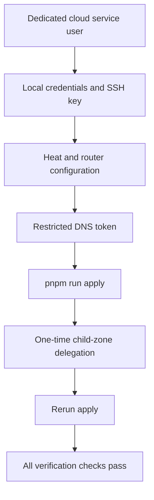
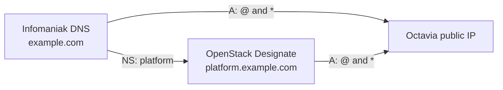

# Infomaniak deployment checklist

This checklist is the compact operator version of the
[main deployment guide](../README.md). Commands run from `openstackV3`.

The examples use:

- parent domain: `example.com`;
- delegated platform domain: `platform.example.com`;
- Heat stack: `toad-prod`.

Replace them with values belonging to the target environment.

## Deployment overview



## 1. Create a project service user

In Infomaniak Manager, open **Public Cloud → Users** and create a user dedicated
to this deployment. Grant the project roles needed by Nova, Neutron, Heat,
Octavia, and Designate. Store its generated password in a password manager.

Use password authentication for the full Heat deployment. Infomaniak Heat
creates a Keystone trust, which cannot be created from a delegated application
credential.

Download `clouds.yaml` from Infomaniak and place it at:

```text
credentials/clouds.yaml
```

If creating it manually, use the endpoint, project, region, and username shown
by your own Public Cloud project. A minimal shape is:

```yaml
clouds:
  openstack:
    auth:
      auth_url: https://api.REGION.infomaniak.cloud/identity/v3
      project_name: YOUR_PROJECT_NAME
      project_domain_name: Default
      username: YOUR_SERVICE_USER
      user_domain_name: Default
    region_name: YOUR_REGION
    interface: public
    identity_api_version: 3
```

Then initialize local tooling and credentials:

```sh
pnpm install --frozen-lockfile
pnpm run setup
pnpm run doctor -- --cloud
pnpm run discover
```

`setup` stores a separately prompted password with mode `0600`, creates the
project-local Python environment, generates a project SSH key, and uploads its
public half. Never commit anything under `credentials/`.

## 2. Prepare configuration

```sh
cp heat/env/example.yaml heat/env/production.yaml
cp ../router/config.example.yaml ../router/config.yaml
```

Use values printed by `pnpm run discover` in `heat/env/production.yaml`:

```yaml
parameters:
  flavor: "YOUR_FLAVOR"
  image: "YOUR_IMMUTABLE_IMAGE_UUID"
  keypair_name: "toad-key"
  public_network: "YOUR_PUBLIC_NETWORK"
  ssh_allowed_cidr: "192.0.2.1/32"
  dns_zone_name: "platform.example.com."
  dns_email: "hostmaster@example.com"
  manager1_availability_zone: "YOUR_AZ_1"
  manager2_availability_zone: "YOUR_AZ_2"
  manager3_availability_zone: "YOUR_AZ_3"
```

Use an immutable image UUID. The `apply` command automatically replaces the
documentation SSH address with the current operator public IPv4 `/32`.

Configure `../router/config.yaml`:

```yaml
letsencrypt_email: admin@example.com
traefik_log_level: INFO
base_domain: platform.example.com
root_domain: example.com
```

The parent apex and wildcard will be routed to TOAD. If the parent already
hosts unrelated traffic, use a dedicated domain or review the DNS ownership
model before continuing.

## 3. Store the DNS token

Create an Infomaniak API token limited to `dns:read` and `dns:write`, then use
the non-echoing prompt:

```sh
pnpm run dns-token
```

The token is local, Git-ignored, and delivered to Traefik only as a
content-addressed Docker secret.

## 4. Validate and deploy

```sh
pnpm run check
pnpm run doctor -- --cloud
pnpm run apply -- toad-prod heat/env/production.yaml
```

The command creates or updates the cloud resources, generates inventory,
configures Docker and Swarm, deploys ingress and monitoring, synchronizes
parent DNS, and runs acceptance checks.

The first run may reach the final verification before public DNS can resolve
the new delegated zone. Keep the stack; complete the delegation and rerun the
same command.

## 5. Delegate the child zone once

Read the child zone's `NS` record:

```sh
pnpm run os -- recordset list platform.example.com.
```

In the Infomaniak parent zone for `example.com`, add `NS` records named
`platform` using the authoritative nameservers returned by Designate. Do not
copy nameservers from this documentation; use those returned for the target
cloud and region.

The ownership boundary is:



The delegation deliberately survives stack destruction. TOAD does not change
parent MX, TXT, CAA, or unrelated records.

Rerun:

```sh
pnpm run apply -- toad-prod heat/env/production.yaml
```

## 6. Verify and open the admin interfaces

```sh
pnpm run verify -- toad-prod --json
```

Import `credentials/admin-pki/operator.p12` into the operator browser using its
adjacent password file. The certificate opens:

- `https://traefik.platform.example.com/dashboard/`;
- `https://grafana.platform.example.com/`;
- `https://prometheus.platform.example.com/`;
- `https://alerts.platform.example.com/`.

Issue separate identities for other operators:

```sh
pnpm run admin-pki -- issue alice-laptop 90
```

## 7. Day-two commands

```sh
pnpm run maintenance -- status --json
pnpm run verify -- toad-prod --json
pnpm run app -- create my-service
pnpm run app -- validate my-service
pnpm run app -- deploy my-service
pnpm run app -- diagnose my-service --json
```

For recovery and destruction, read
[`docs/OPERATIONS.md`](../docs/OPERATIONS.md) and
[`docs/DISASTER-RECOVERY.md`](../docs/DISASTER-RECOVERY.md) first.
